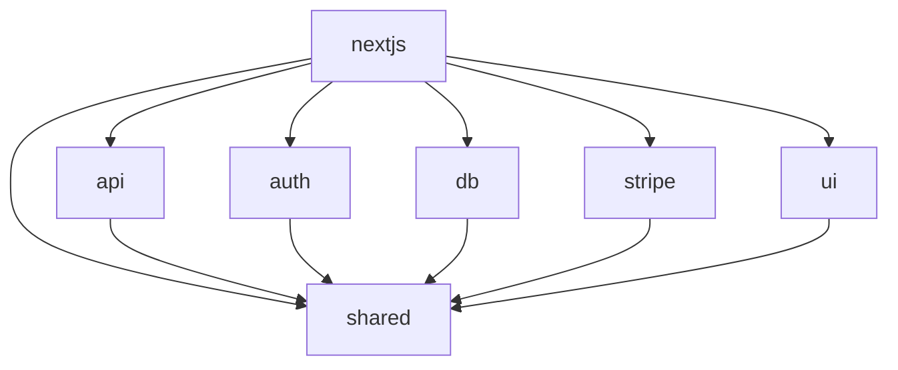

# Pandora's Monorepo

Este monorepo contiene todas las aplicaciones y paquetes de Pandora's, organizados para máxima reutilización y escalabilidad.

## Estructura del repositorio

```
apps/
  nextjs/         # Aplicación principal Next.js
  auth-proxy/     # Proxy de autenticación
packages/
  api/            # Lógica y tipos de API
  auth/           # Lógica de autenticación
  db/             # Acceso y migraciones de base de datos
  shared/         # Utilidades y configuraciones compartidas (antes 'common')
  stripe/         # Integración con Stripe
  ui/             # Componentes UI reutilizables
  ...
tooling/
  eslint-config/  # Configuración centralizada de ESLint
  prettier-config/# Configuración centralizada de Prettier
  tailwind-config/# Configuración centralizada de Tailwind
  typescript-config/# Configuración centralizada de TypeScript
```

## Principios
- **Centralización de configuración:** ESLint, Prettier, Tailwind y TypeScript se configuran en `tooling/` y se extienden en todos los paquetes/apps.
- **Componentes UI genéricos:** Solo en `packages/ui`. Los específicos de la app van en `apps/nextjs/src/components`.
- **Código compartido:** Todo lo reutilizable va en `packages/shared`.
- **Nombres claros:** Cada paquete/carpeta refleja su propósito.

## Scripts útiles

- `pnpm lint` — Linting de todo el monorepo
- `pnpm format` — Formateo de todo el monorepo
- `pnpm dev` — Desarrollo en paralelo de apps

## Diagrama de dependencias



## Estructura de rutas Next.js
- `/[lang]/(dashboard)/dashboard` — Dashboard principal
- `/[lang]/(marketing)/invest` — Página de inversión
- `/[lang]/(auth)/login` — Login
- `/[lang]/(docs)/` — Documentación

---

> Para más detalles, revisa los README de cada paquete/app.