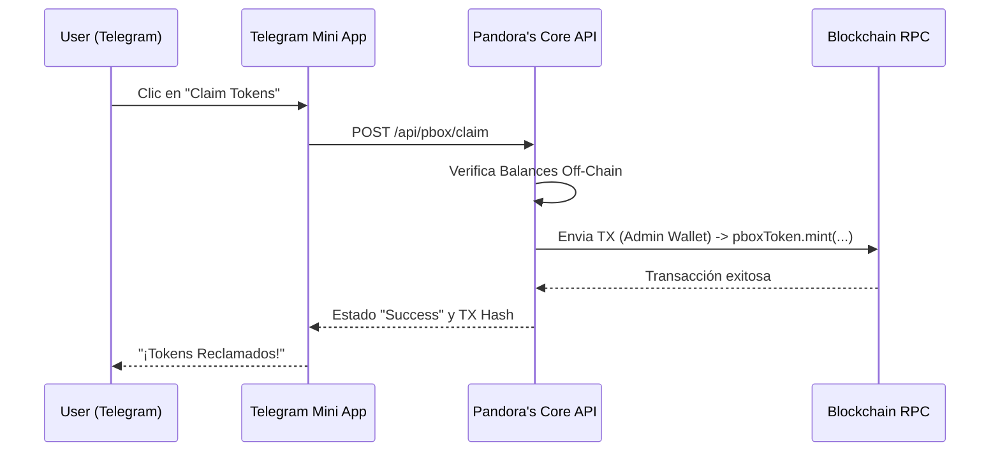

# Telegram App & PBOX Token: Rules of Engagement

Este documento detalla los límites arquitectónicos entre la **Telegram Mini App** (el cliente) y **Pandora's Core** (el proveedor de identidad y protocolo).

## Principio Rector
> **Pandora's Core = Soberanía económica y de identidad**
> **Telegram App = UX, activación y engagement**

Todo lo que afecte *supply, balances, claims, conversiones* y *permisos* reside de manera exclusiva en **Pandora's Core**.

### Qué **SÍ** hace la Telegram App:
- **Mostrar "PBOX Earned"**: Consulta mediante la API los balances off-chain almacenados en la base de datos de Pandora.
- **Mostrar botón de "Claim"**: Presenta indicadores visuales de disponibilidad de reclamo (ej. cuando se llega al mínimo requerido).
- **Producir Gamificación**: Transmite "Intents" y acciones realizadas por el usuario al endpoint de métricas.
- **Pedir Claim**: Envía un `POST` autenticado (vía token de Telegram) a Pandora Core solicitando el reclamo a la wallet vinculada.
- **Mostrar Estado de Transacciones**: Reflejar el estado de las transacciones devueltas por el webhook o polling (Pending, Success, Failed).

### Qué **NO** hace la Telegram App:
- **Acuñar (Mint) tokens**: No tiene lógica, permisos, ni dependencias de contratos para mintear PBOX.
- **Quemar (Burn) tokens**: Las lógicas de quema existen exclusivamente on-chain o controlados vía el Core Backend.
- **Generar o validar firmas (Vouchers)**: No incluye algoritmos para decidir quién puede reclamar, no almacena la `CLAIM_SIGNER_KEY`, y bajo el "Approach B", su único rol es asistir a que el usuario local firme el payload generado.
- **Actualizar "Supply Logic"**: No toma decisiones sobre límites diarios o máximos.
- **Determinar Balance Final**: El único balance verdadero es el de la "Blockchain" dictado por la suma de registros on-chain e índices off-chain en Core.

### Flujo Operativo Actual (Approach A)

### Regla de Oro Continua
> **Si un bug en el cliente de Telegram pudiera inflar el supply o saltar un paso crítico, significa que el límite de confianza Backend/Frontend ha sido violado.**
En la arquitectura de Pandora, la App de Telegram siempre podrá ser reemplazada, borrada o re-hecha, sin impactar una sola fracción del Tokenómico de PBOX.
