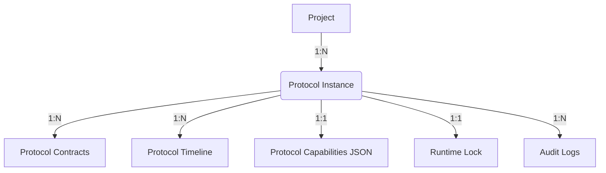
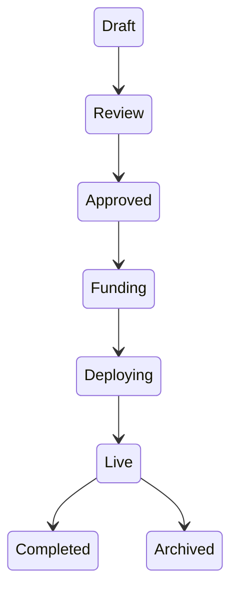
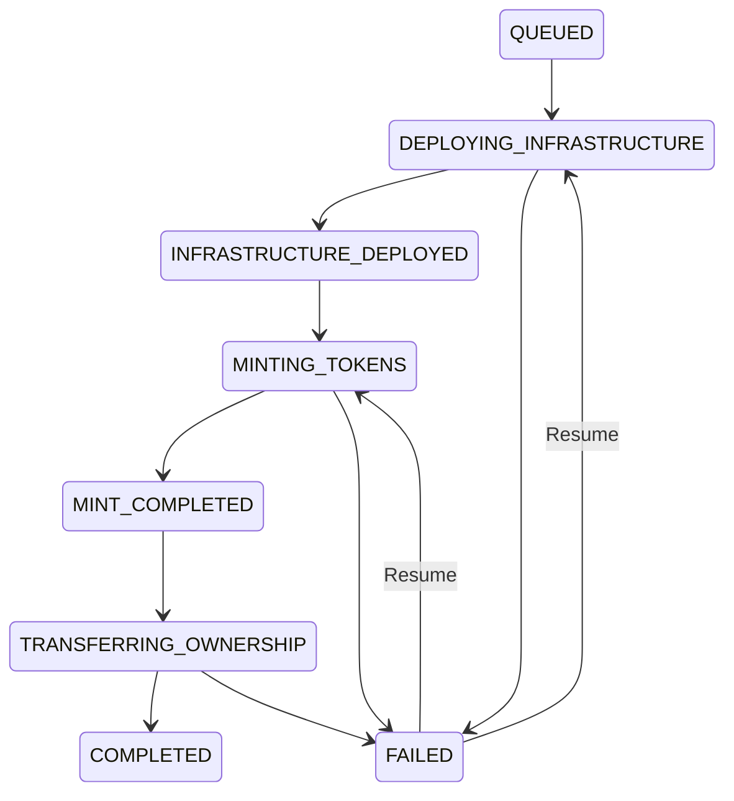
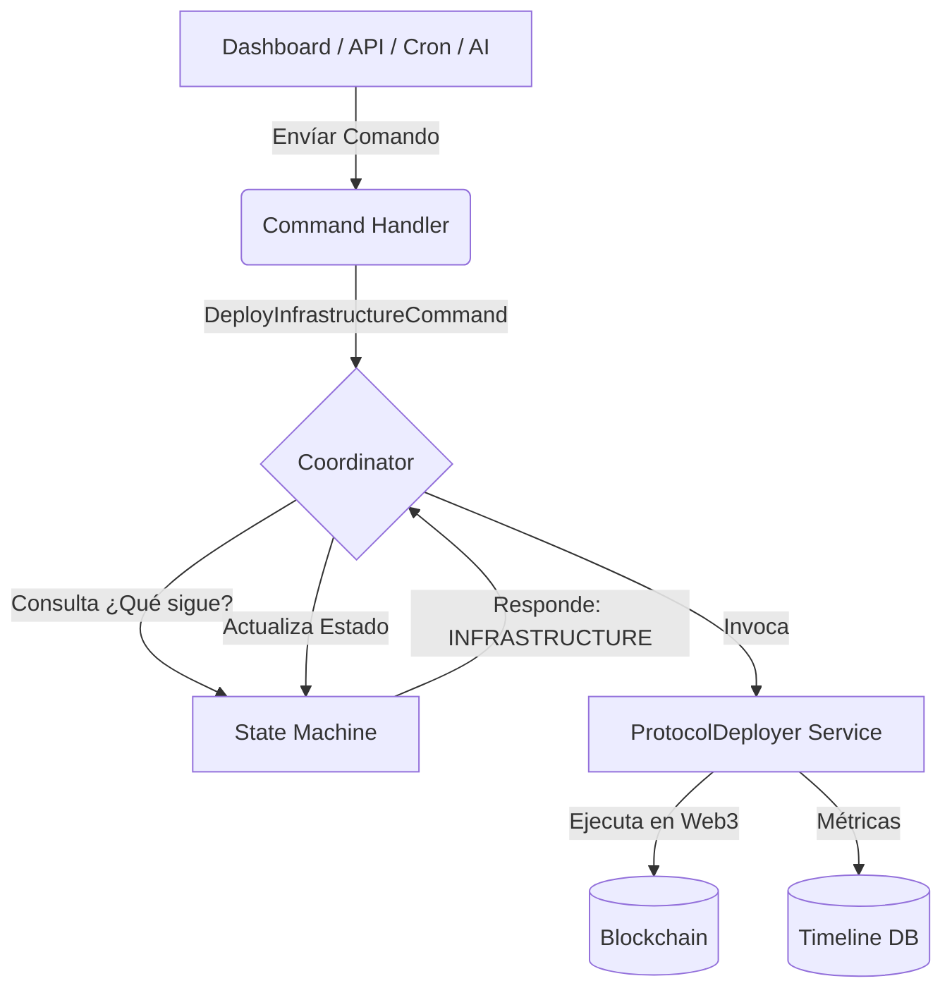

# Pandora Protocol Kernel (Runtime Domain Model)

Este documento define el contrato arquitectónico, el modelo de dominio y la máquina de estados que gobernarán la vida operativa de los protocolos en Pandora. Ya no estamos ante un script de despliegue, sino ante el **Kernel del Protocolo**.

## 1. Diagrama de Entidades (Domain Hierarchy)

El siguiente diagrama muestra la relación jerárquica de las entidades principales que componen el Runtime del protocolo. Si este diagrama se entiende, la base de datos está lista.

---

## 2. Entidades y Agregados (Domain Entities)

Las PKs internas serán siempre `BIGSERIAL` para optimización de Drizzle/Postgres, y usaremos `UUID` únicamente para exposición pública (identidad externa).

### `Project` (Agregado Raíz del Negocio)
La representación off-chain de la iniciativa.
- **Identidad**: `id` (BIGSERIAL), `projectUuid` (UUID).
- **Estado**: Rige bajo el `ProjectLifecycle` (Draft, Review, Funding, etc).

### `ProtocolInstance` (Antes Manifest)
La representación técnica y on-chain. Un `Project` puede tener múltiples instancias (Base, Arbitrum, v1, v2).
- **Identidad Interna**: `id` (BIGSERIAL).
- **Identidad Pública**: `instanceUuid` (UUID).
- **Relación**: `projectId` (BIGINT).
- **Configuración (Columnas explícitas)**: 
  - `chainId` (INT)
  - `runtimeState` (VARCHAR)
  - `factoryVersion` (VARCHAR)
  - `contractsVersion` (VARCHAR)
  - `runtimeVersion` (VARCHAR)
  - `deploymentSchemaVersion` (VARCHAR)
- **JSONB**: `capabilities` (Módulos activos: DAO, NFT, Mortgage), `metadata`, `configuration`.

### `ProtocolContract` (Infraestructura Desglosada)
No más JSONs de direcciones. Cada contrato es una fila propia para máxima consultabilidad.
- **Identidad**: `id` (BIGSERIAL), `instanceId` (BIGINT).
- **Atributos**: `contractType` (ej: Governor, Treasury, NFT), `address` (VARCHAR), `version` (VARCHAR).

### `ProtocolRuntimeLock` (Protección contra Caídas)
El candado absoluto para proteger la concurrencia, con soporte para caídas de workers (Railway/Vercel).
- **Identidad**: `id` (BIGSERIAL), `instanceId` (BIGINT).
- **Atributos**: `workerId` (VARCHAR), `status` (Locked, Released).
- **Timeouts**: `startedAt`, `expiresAt`, `heartbeat` (TIMESTAMP). 

### `ProtocolTimelineEvent` (UX Event Sourcing)
El registro perpetuo de la vida del protocolo para ser mostrado al usuario.
- **Identidad**: `id` (BIGSERIAL), `eventUuid` (UUID), `instanceId` (BIGINT).
- **Contexto**: `phase` (ej: Mint, Upgrade), `actor` (Coordinator, User, Admin), `source` (Worker, API), `severity` (Info, Success, Warning, Error).
- **Datos**: `metadata` (JSONB con hashes y detalles), `timestamp`.

### `ProtocolAuditLog` (Compliance y Auditoría)
Totalmente separado del Timeline. Registro inmutable para fines legales y de seguridad.
- **Identidad**: `id` (BIGSERIAL), `instanceId` (BIGINT).
- **Atributos**: `action`, `performedBy`, `previousState`, `newState`, `ipAddress`, `timestamp`.

---

## 3. Máquinas de Estado (State Machines)

### A. `ProjectLifecycle` (Negocio)

### B. `runtimeState` (Infraestructura Técnica)
La Máquina de Estados que dicta la siguiente acción al Coordinador.

---

## 4. Arquitectura de Flujo (CQRS Pattern)

Implementaremos un patrón de Comandos y Manejadores (Command & Command Handler) orquestados por una Máquina de Estados.

---

## 5. Invariantes del Sistema (Reglas de Oro)

1. **Invariante de Infraestructura**: Un `DeployInfrastructureCommand` **jamás** se ejecuta si `provider.getCode(predictAddress(salt))` retorna un bytecode válido.
2. **Invariante de Heartbeat (Locks)**: Si un `ProtocolRuntimeLock` tiene un `heartbeat` expirado, el candado se considera huérfano y puede ser sobreescrito por un nuevo worker de rescate.
3. **Invariante de Concurrencia**: Ningún comando mutacional puede ejecutarse si el `runtimeState` está en una fase transitiva (`DEPLOYING_*`, `MINTING_*`).
4. **Invariante de Audit**: Ningún registro en `ProtocolAuditLog` puede ser modificado jamás.
