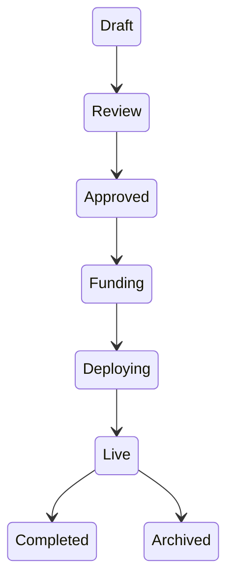
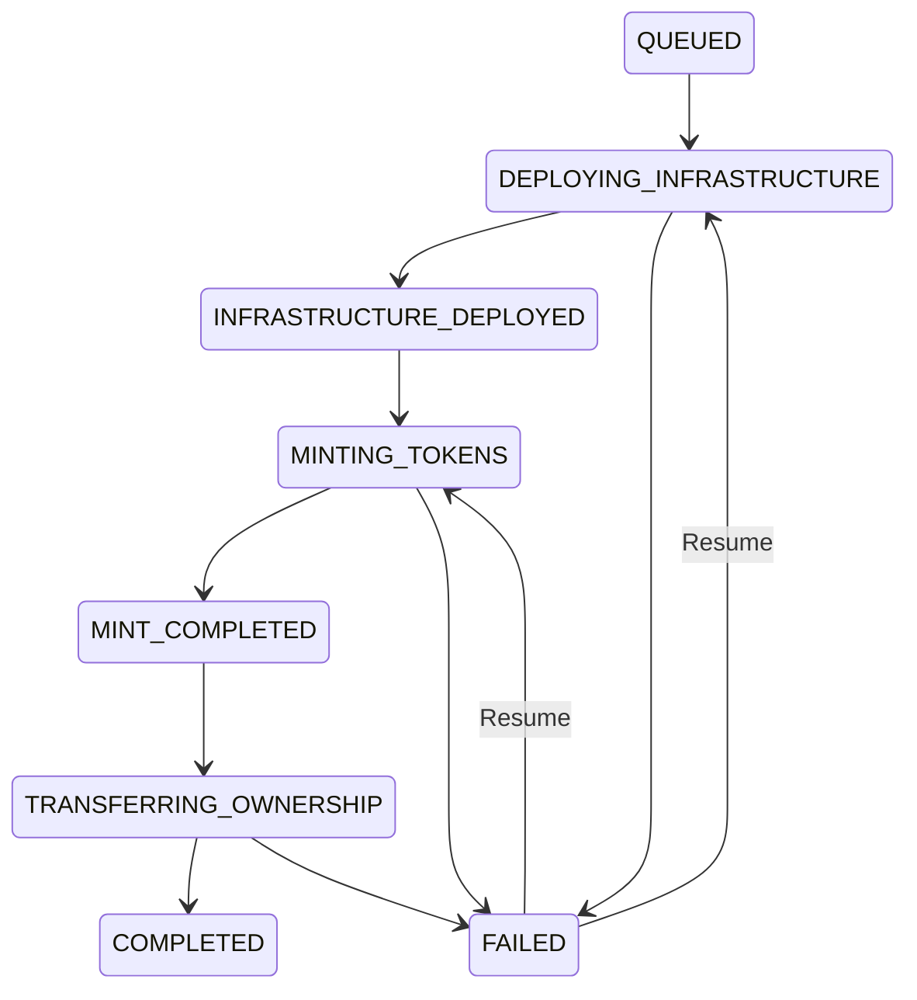
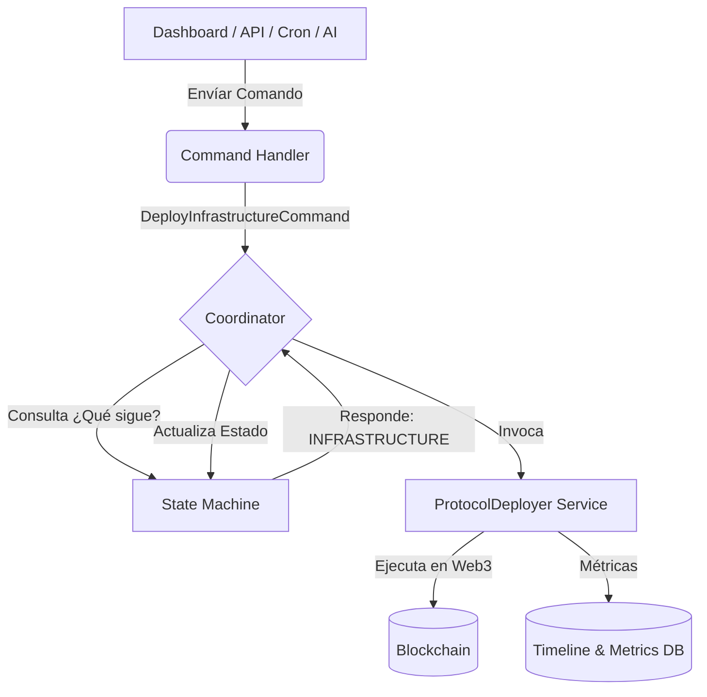

# Pandora Protocol Kernel (Runtime Domain Model)

Este documento define el contrato arquitectónico, el modelo de dominio y la máquina de estados que gobernarán la vida operativa de los protocolos en Pandora. Ya no estamos ante un script de despliegue, sino ante el **Kernel del Protocolo**.

## User Review Required

> [!CAUTION]
> **Aprobación del Modelo de Dominio**
> Este documento rige todas las decisiones de diseño futuras. Revisa las Entidades, la Máquina de Estados y el flujo de los Command Handlers. Si este modelo es 100% fiel a la visión técnica a largo plazo, el siguiente paso será traducirlo al esquema de Base de Datos (`schema.ts`).

---

## 1. Entidades y Agregados (Domain Entities)

La base de datos y la memoria dejarán de usar JSONs monolíticos para adoptar entidades relacionales y ricas.

### `Project` (Agregado Raíz del Negocio)
La representación off-chain de la iniciativa.
- **Identidad**: `id` (UUID inmutable).
- **Atributos**: `slug`, `title`, `applicant`, `tokenomicsConfig`.
- **Estado**: Rige bajo el `ProjectLifecycle`.

### `ProtocolManifest` (El Alma del Protocolo)
La representación técnica y on-chain. Un `Project` puede tener múltiples Manifests si se despliega cross-chain.
- **Identidad**: `id` (UUID), `projectId`, `chainId`.
- **Versionado**: `factoryVersion`, `contractsVersion`, `runtimeVersion`, `deploymentSchema`.
- **Trazabilidad**: `createdAt`, `updatedAt`, `salt` (keccak256 de version+chain+project).

### `ProtocolContracts` (Infraestructura)
Entidad hija del Manifest. Contiene las referencias en la blockchain.
- `registry`, `dao`, `treasury`, `governor`, `utilityToken`, `licenseToken`, `oracle`.

### `ProtocolTimelineEvent` (Event Sourcing)
El registro perpetuo de la vida del protocolo. No muere tras el despliegue.
- **Atributos**: `manifestId`, `timestamp`, `eventType` (ej: `InfrastructureCreated`, `MintExecuted`, `ProposalApproved`, `TreasuryUpgraded`), `metadata` (JSON con detalles).

### `ProtocolCapability` (Feature Flags)
Define qué módulos están encendidos para un protocolo.
- `supportsDAO`, `supportsNFT`, `supportsMarketplace`, `supportsMortgage`, `supportsRevenueDistribution`, `supportsSecondaryMarket`.

### `ProtocolMetrics` & `HealthScore`
- **Métricas de Ejecución**: `gasUsed`, `executionTime`, `rpcLatency`, `confirmationTime`, `retryCount`.
- **Health Score**: Puntuaciones en vivo (`Infrastructure: 100%`, `Treasury: Healthy`, `Oracle: Healthy`, `LastSync`).

---

## 2. Máquinas de Estado (State Machines)

Separamos estrictamente la vida del negocio de la vida técnica.

### A. `ProjectLifecycle` (Negocio)

### B. `DeploymentLifecycle` (Infraestructura Técnica)
La Máquina de Estados que dicta la siguiente acción al Coordinador.

---

## 3. Arquitectura de Flujo (CQRS Pattern)

Implementaremos un patrón de Comandos y Manejadores (Command & Command Handler) orquestados por una Máquina de Estados.

### Comandos Soportados (Ejemplos)
- `DeployInfrastructureCommand`
- `MintTokensCommand`
- `TransferOwnershipCommand`
- `PauseProtocolCommand`
- `UpgradeContractsCommand`

---

## 4. Invariantes del Sistema (Reglas de Oro)

1. **Invariante de Infraestructura**: Un `DeployInfrastructureCommand` **jamás** se ejecuta si `provider.getCode(predictAddress(salt))` retorna un bytecode válido. Lanza `AlreadyDeployedException`.
2. **Invariante de Factoría**: El Runtime asume que la Factory es estática e inmutable. Si la Factory no existe en el `chainId` solicitado, lanza `CriticalInfrastructureError`.
3. **Invariante de Concurrencia**: Ningún comando mutacional puede ejecutarse si el `DeploymentLifecycle` está en un estado transitivo (`DEPLOYING_*`, `MINTING_*`). Lanza `DeploymentLockException`.
4. **Invariante de Timeline**: Ningún registro en `ProtocolTimelineEvent` puede ser actualizado o borrado (Event Sourcing estricto: solo Append).

---

## 5. El Reporte Final (Deployment Report)

Una vez que el `DeploymentLifecycle` alcanza `COMPLETED`, el sistema emitirá un `DeploymentReport` congelado en el tiempo. Este documento (descargable en PDF/JSON) será la "Partida de Nacimiento" del Protocolo, resumiendo los saltos, gas gastado, hashes de transacciones, capacidades activadas y configuración genésica.
