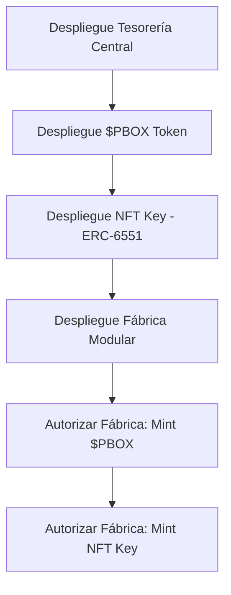
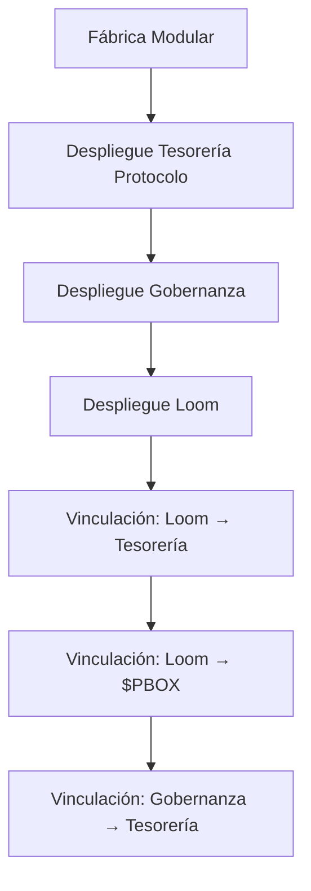
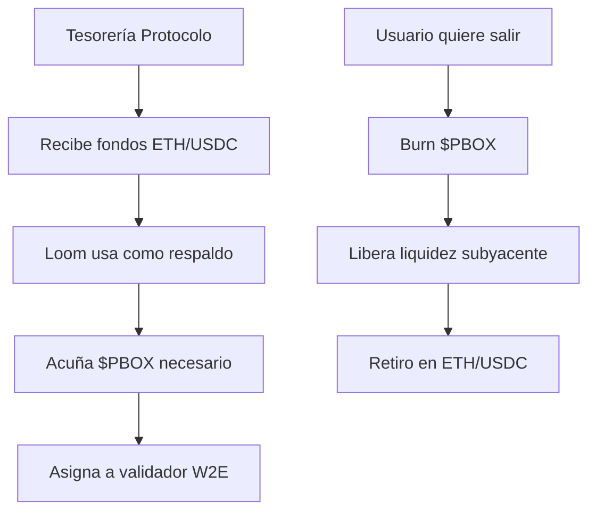

# 🏗️ Arquitectura de Doble Infraestructura SCaaS

**Guía Completa para la Separación de Contratos Core vs Modulares en Pandora's**

## 🎯 **Visión General**

En una plataforma **SCaaS (Smart Contract as a Service)** como Pandora's, la separación de la infraestructura fija (**Core**) de la infraestructura modular (**Creation**) es crucial para la seguridad, el gas y la escalabilidad.

### **Separación Lógica Clave**

| Criterio | Core (Plataforma) | Modular (Creación) |
|----------|------------------|-------------------|
| **Despliegue** | UNA SOLA VEZ | N veces (por creación) |
| **Flujo de Fondos** | Tesorería Central (Root) | Tesorería de Protocolo |
| **Responsabilidad** | Seguridad y Consistencia | Lógica de Negocio Específica |
| **Ejemplos** | $PBOX Token, NFT Key, Fábrica | Loom, Governor, Tesorería Protocolo |

---

## 🏛️ **1. Contratos Fijos de Plataforma (Core System)**

Estos contratos son la infraestructura central de Pandora's. Se despliegan **UNA SOLA VEZ** y nunca se replican.

### **Nomenclatura Funcional**

| Contrato | Propósito Único | Rol Clave / Vinculación |
|----------|-----------------|-------------------------|
| **Tesorería Central (Root)** | Caja Fuerte de Comisiones | Multi-Sig Puro (sin Ownable) con Timelock condicional |
| **Token de Utilidad ($PBOX)** | Token Nativo del Ecosistema | Delega mint permissions a Fábrica Modular |
| **NFT de Acceso (Key)** | Identidad del Usuario | Vinculado a ERC-6551 para Token Bound Accounts |
| **Fábrica Modular** | Orquestador de Despliegue | Permisos para mint/burn $PBOX y NFT Key |

### **Flujo del Despliegue Core (1 vez)**



### **Implementación Core - Contratos Actuales**

#### **1.1 Tesorería Central (PandoraRootTreasury.sol)**
```solidity
contract PandoraRootTreasury {
    // ✅ Multi-Sig puro (sin Ownable)
    // ✅ Timelock condicional para retiros altos
    // ✅ Recibe fees de todas las Creaciones

    mapping(address => bool) public signers;
    uint256 public requiredConfirmations;
    uint256 public highValueThreshold;
    uint256 public constant HIGH_VALUE_TIMELOCK = 48 hours;
}
```

#### **1.2 Token de Utilidad ($PBOX)**
```solidity
contract PBOXToken is ERC20, AccessControl {
    // ✅ Token nativo del ecosistema
    // ✅ Mint permissions delegados a Fábrica
    // ✅ Burn mechanism para liquidez

    bytes32 public constant MINTER_ROLE = keccak256("MINTER_ROLE");
    address public factory;

    function mint(address to, uint256 amount) external onlyRole(MINTER_ROLE) {
        // Solo Fábrica Modular puede mint
    }
}
```

#### **1.3 NFT de Acceso (Key)**
```solidity
contract PandoraKey is ERC721A, ERC6551Account {
    // ✅ Ya implementado en NFTGate
    // ✅ Vinculado a ERC-6551 para TBA
    // ✅ Validación de acceso a plataforma
}
```

#### **1.4 Fábrica Modular (Core)**
```solidity
contract ModularFactory {
    // ✅ Orquestador de despliegues de alto nivel
    // ✅ Despliega creaciones completas con ProtocolController
    // ✅ Gestiona ciclo de vida de múltiples creaciones

    address public pboxToken;
    address public pandoraKey;
    address public rootTreasury;

    function deployProtocolStack(string memory slug, DeploymentConfig memory config)
        external payable
        returns (ContractAddresses memory addresses)
    {
        // Despliega: Tesorería + ProtocolController + Loom + Governor
        // Vincula automáticamente todos los contratos
        // Transfiere capital inicial
    }
}
```

#### **1.5 W2EProtocolController (Por Creación)**
```solidity
contract W2EProtocolController {
    // ✅ Controlador operativo de cada creación
    // ✅ Orquesta módulos especializados (TaskManager, RewardDistributor)
    // ✅ Gestiona recaudación, fases y payouts del creador

    IW2ETaskManager public taskManager;
    IW2ERewardDistributor public rewardDistributor;

    function createValidationTask(...) external returns (uint256) {
        return taskManager.createValidationTask(...);
    }

    function finalizeTaskWithRewards(uint256 taskId) external {
        taskManager.finalizeTask(taskId);
        // Delegar distribución de recompensas
    }
}
```

---

## 🧩 **2. Contratos Modulares por Creación (Stack Modular)**

Estos contratos son los activos y la lógica de negocio de cada Creación. Se despliegan **CADA VEZ** que se lanza un Protocolo.

### **Nomenclatura Funcional**

| Contrato | Propósito Específico | Vínculos Clave en Constructor |
|----------|---------------------|-------------------------------|
| **Tesorería de Protocolo** | Caja Fuerte de la Creación | Root Treasury + Governor |
| **Contrato de Gobernanza** | Reglas del DAO | Tesorería de Protocolo |
| **Motor de la Lógica (Loom)** | Núcleo W2E | Tesorería + $PBOX Token |

### **Flujo del Despliegue Modular (N veces)**



### **Implementación Modular - Stack por Creación**

#### **2.1 Tesorería de Protocolo (PBOXProtocolTreasury.sol)**
```solidity
contract PBOXProtocolTreasury is Ownable, ReentrancyGuard {
    // ✅ Tesorería específica del protocolo
    // ✅ Control híbrido: Pandora + DAO
    // ✅ Límites diarios y emergencias

    address public rootTreasury;      // ✅ Envía fees a Root
    address public governor;          // ✅ DAO controla retiros
    address public loom;              // ✅ Loom usa fondos para W2E

    uint256 public dailySpendingLimit;
    uint256 public spentToday;
}
```

#### **2.2 Contrato de Gobernanza (W2EGovernor.sol)**
```solidity
contract W2EGovernor is Governor, GovernorTimelockControl {
    // ✅ Gobernanza DAO por protocolo
    // ✅ 1 Licencia VHORA = 1 Voto
    // ✅ Propuestas para retiros de fondos

    IERC721 public licenseNFT;
    PBOXProtocolTreasury public protocolTreasury;

    constructor(IERC721 _licenseNFT, address _protocolTreasury, address timelock) {
        licenseNFT = _licenseNFT;
        protocolTreasury = PBOXProtocolTreasury(_protocolTreasury);
    }
}
```

#### **2.3 Motor de la Lógica (W2ELoom.sol)**
```solidity
contract W2ELoom is Ownable, ReentrancyGuard {
    // ✅ Núcleo W2E por protocolo
    // ✅ Gestiona tareas, staking, recompensas
    // ✅ Conecta trabajo con $PBOX

    PBOXProtocolTreasury public protocolTreasury;
    PBOXToken public pboxToken;
    IW2ELicense public licenseNFT;

    constructor(
        address _protocolTreasury,
        address _pboxToken,
        address _licenseNFT
    ) {
        protocolTreasury = PBOXProtocolTreasury(_protocolTreasury);
        pboxToken = PBOXToken(_pboxToken);
        licenseNFT = IW2ELicense(_licenseNFT);
    }
}
```

---

## 💰 **3. Rol del Token $PBOX (Utilidad Interna)**

El $PBOX es un **Token de Utilidad de Propósito Único (SPUT)**. Su función principal no es ser un activo de inversión, sino ser la unidad de cuenta y el "Combustible del Trabajo" dentro del ecosistema.

### **Rol Funcional**

| Función | Descripción | Implementación Smart Contract |
|---------|-------------|-------------------------------|
| **Unidad de Cuenta** | Representa valor del trabajo | Moneda para pagos W2E |
| **Mecanismo de Recompensa** | Recibe por Validar/Votar/Tareas | Mint directo desde Tesorería → Loom → Usuario |
| **Derecho de Staking/Voto** | Staking para Creaciones/Voto | Stake en Loom o Governor |

### **Flujo de Visibilidad (Volatilidad Controlada)**

#### **Modelo de Acceso: Interno Controlado**
- **Volatilidad**: Controlada inicialmente, no promovido como inversión
- **Distribución**: Solo por Trabajo (W2E), no compra directa
- **Acceso al Público**: Limitado/Cerrado, solo en Dashboard de Recompensas

#### **Flujo de Suministro (Mint & Burn)**


### **Implicación para el Front-end**

| Componente | Interfaz de $PBOX |
|------------|-------------------|
| **Dashboard Usuario** | $PBOX Acumulado + $PBOX en Staking |
| **Componente Tareas** | Costo en $PBOX para participar + Recompensa |
| **Retiros/Swap** | Mecanismo interno que ejecuta Burn en Loom |

---

## 🔄 **4. Flujo de Despliegue Completo**

### **Fase 1: Setup Core (Una Vez)**
```bash
# 1. Despliegue contratos core
forge script script/DeployCore.s.sol --rpc-url $BASE_RPC_URL --broadcast

# 2. Configuración de permisos
# Fábrica obtiene permisos de mint para $PBOX y NFT Key
```

### **Fase 2: Deploy Modular (Por Creación)**
```typescript
// Desde el dashboard admin
const result = await deployProtocolStack('mi-proyecto', {
  targetAmount: ethers.parseEther('100'),
  creatorPayoutPct: 10,
  quorumPercentage: 10,
  votingPeriodHours: 168
});

// Resultado: direcciones de Loom, Governor, Tesorería
```

### **Fase 3: Vinculación y Activación**
```solidity
// Fábrica ejecuta vinculaciones automáticamente
loom.setTreasuryPermissions(protocolTreasury);
governor.setTreasuryPermissions(protocolTreasury);
protocolTreasury.setGovernor(governor);
protocolTreasury.setLoom(loom);
```

---

## 🛡️ **5. Consideraciones de Seguridad**

### **Separación de Riesgos**
- **Core**: Seguridad máxima, cambios raros, multi-sig obligatorio
- **Modular**: Flexibilidad por protocolo, actualizaciones posibles
- **Fondos**: Core maneja comisiones, Modular maneja capital operativo

### **Upgradability**
- **Core**: No upgradable (seguridad máxima)
- **Modular**: Upgradeable vía gobernanza del protocolo
- **Factory**: Upgradeable por timelock de 48h

### **Auditoría y Monitoreo**
- **Core**: Auditoría externa obligatoria
- **Modular**: Auto-auditoría vía gobernanza
- **Factory**: Monitoreo continuo de despliegues

---

## 📊 **6. Métricas de Éxito**

### **Core System**
- **Uptime**: 99.9%+ disponibilidad
- **Security**: 0 exploits en contratos core
- **Gas Efficiency**: Optimización para despliegues masivos

### **Modular System**
- **Deployment Success**: 100% de despliegues exitosos
- **Protocol Health**: >95% de protocolos activos
- **User Adoption**: Crecimiento en usuarios W2E

### **Economic Model**
- **PBOX Utility**: Alto engagement en staking/voting
- **Fee Collection**: Sostenibilidad económica
- **Value Creation**: ROI positivo para creadores

---

## 🚀 **Implementación Recomendada**

1. **✅ Core Deployment**: Desplegar contratos fijos primero
2. **🔧 Factory Development**: Completar lógica de orquestación
3. **🧪 Modular Testing**: Validar stack completo en testnet
4. **📈 Mainnet Launch**: Deploy core en Base mainnet
5. **📊 Monitoring Setup**: Métricas y alertas desde día 1

Esta arquitectura garantiza **escalabilidad infinita** mientras mantiene la **seguridad máxima** para el capital de los usuarios y creadores.
